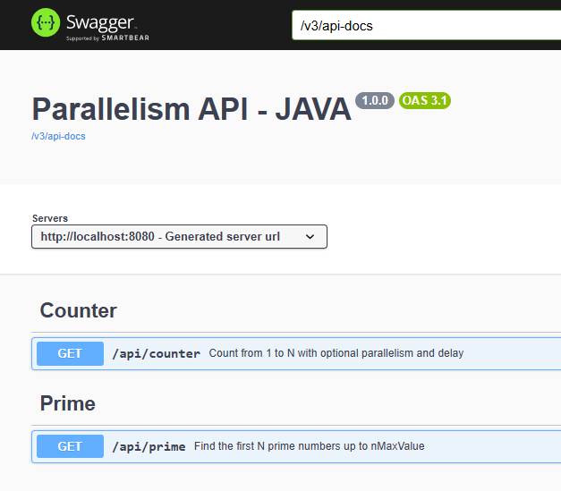

# Portfolio — Java Parallelism Exploration

A Spring Boot REST API built with **Java 21** that experiments with concurrency strategies side-by-side:
sequential execution, fixed-size thread pools, and virtual threads.
Every request captures live JVM metrics so stress tests produce real, comparable data.

---

## Architecture Overview

```
┌─────────────────────────────────────────────────────────────────┐
│                        HTTP Client                              │
│              (browser / curl / k6 / stress test)                │
└───────────────────────────┬─────────────────────────────────────┘
                            │  REST  (port 8080)
┌───────────────────────────▼─────────────────────────────────────┐
│                     Spring Boot App                             │
│                                                                 │
│   ┌─────────────────────┐      ┌─────────────────────────────┐  │
│   │   CounterController │      │      PrimeController        │  │
│   │  GET /api/counter   │      │     GET /api/prime          │  │
│   └──────────┬──────────┘      └──────────────┬──────────────┘  │
│              │                                │                 │
│   ┌──────────▼──────────┐      ┌──────────────▼──────────────┐  │
│   │   CounterService    │      │        PrimeService         │  │
│   │                     │      │                             │  │
│   │  parallelProcess=1  │      │   parallelProcess=1         │  │
│   │  ┌───────────────┐  │      │   ┌─────────────────────┐   │  │
│   │  │  Sequential   │  │      │   │     Sequential      │   │  │
│   │  │  single thread│  │      │   │   single thread     │   │  │
│   │  └───────────────┘  │      │   └─────────────────────┘   │  │
│   │                     │      │                             │  │
│   │  parallelProcess=N  │      │   parallelProcess=N         │  │
│   │  ┌───────────────┐  │      │   ┌─────────────────────┐   │  │
│   │  │ FixedThread   │  │      │   │   FixedThreadPool   │   │  │
│   │  │    Pool(N)    │  │      │   │     workers=N       │   │  │
│   │  └───────────────┘  │      │   │  range partitioning │   │  │
│   │                     │      │   └─────────────────────┘   │  │
│   │  parallelProcess=-1 │      │                             │  │
│   │  ┌───────────────┐  │      └─────────────────────────────┘  │
│   │  │ VirtualThread │  │                                       │
│   │  │PerTaskExecutor│  │      ┌─────────────────────────────┐  │
│   │  │  (1 VT / task)│  │      │       MetricsLogger         │  │
│   │  └───────────────┘  │      │  @Scheduled every 5 seconds │  │
│   └─────────────────────┘      │  CPU system% / process%     │  │
│                                │  Heap used / max (MB)       │  │
│              ┌─────────────────┤  NonHeap used (MB)          │  │
│              │   JVM MXBeans   └─────────────────────────────┘  │
│              │  OperatingSystemMXBean  MemoryMXBean             │
│              └──────────────────────────────────────────────────┘
│                                                                 │
│   OpenAPI / Swagger UI  ─►  /swagger-ui.html                   │
└─────────────────────────────────────────────────────────────────┘
```

---

## REST API endpoints


---

## Modules

### `/api/counter` — Parallel Counter

Simulates a sequence of **N external REST API calls** where each call blocks the thread
for `countDelay` milliseconds waiting for the remote response — modelling real-world
I/O-bound workloads such as downstream service calls or database queries.
Each completed "request" records the thread name plus live CPU/heap metrics.

| `parallelProcess` | Strategy | Executor |
|---|---|---|
| `1` | Sequential | main thread |
| `N > 1` | Fixed Thread Pool | `Executors.newFixedThreadPool(N)` |
| `-1` | Virtual Threads | `Executors.newVirtualThreadPerTaskExecutor()` |

**Query parameters**

| Param | Type | Description |
|---|---|---|
| `n` | int ≥ 1 | How many numbers to count |
| `countDelay` | int ≥ 1 | Sleep per step in milliseconds (simulates I/O latency) |
| `parallelProcess` | int ≥ -1 | Concurrency strategy (see table above) |

**Response excerpt**

```json
{
  "summary": {
    "request":  { "n": 100, "countDelay": 50, "parallelProcess": "4" },
    "response": { "startTime": "...", "endTime": "...", "durationMs": 1302, "duration": "00:00:01:302" }
  },
  "items": [
    { "number": 1, "completedTime": "...", "processId": "pool-1-thread-2",
      "cpuLoadPct": 12.4, "heapUsedMb": 64, "heapMaxMb": 256 }
  ]
}
```

---

### `/api/prime` — Parallel Prime Finder

Finds the first `N` prime numbers up to `nMaxValue`.
In parallel mode the search range is split evenly among workers; a shared
`AtomicBoolean` stops all workers once enough primes are collected.

| `parallelProcess` | Strategy |
|---|---|
| `1` | Sequential scan |
| `N > 1` | Fixed Thread Pool — range partitioned across N workers |

**Query parameters**

| Param | Type | Description |
|---|---|---|
| `n` | int ≥ 1 | Number of primes to find |
| `nMaxValue` | int ≥ 2 | Upper bound of the search range |
| `parallelProcess` | int ≥ 1 | Number of parallel workers |

---

### `MetricsLogger` — Background JVM Reporter

Runs every **5 seconds** via `@Scheduled` and logs:

```
[METRICS] CPU system=18.3% process=7.1% | Heap used=72MB max=256MB | NonHeap used=55MB
```

These log lines appear in the console during stress tests and can be correlated
against request timings to observe how each concurrency strategy loads the JVM.

---

## Concurrency Strategies — How They Differ

```
Sequential (parallelProcess = 1)
─────────────────────────────────────────────────────────────────
 Main thread: [task1]──[task2]──[task3]──...──[taskN]
 Total time ≈ N × delay

Fixed Thread Pool (parallelProcess = N)
─────────────────────────────────────────────────────────────────
 Thread-1: [task1]──────────[task4]──────────...
 Thread-2: [task2]──────────[task5]──────────...
 Thread-3: [task3]──────────[task6]──────────...
 Total time ≈ ⌈N/threads⌉ × delay    (bounded by OS threads)

Virtual Threads (parallelProcess = -1)   ← Java 21 / Project Loom
─────────────────────────────────────────────────────────────────
 VT-1:  [task1]   (mounted on carrier thread, unmounted on sleep)
 VT-2:  [task2]   (carrier thread reused for other VTs)
 VT-3:  [task3]
  ...
 VT-N:  [taskN]
 Total time ≈ 1 × delay   (all tasks truly concurrent, no thread limit)
 Memory per VT ≈ ~few KB  vs ~1 MB for platform thread
```

The key difference: a **platform thread** blocks its OS thread during `Thread.sleep()`;
a **virtual thread** is unmounted from the carrier thread and the carrier becomes free
to run other virtual threads. This makes virtual threads ideal for I/O-bound workloads
at high concurrency.

---

## Scalability Characteristics

The two endpoints have opposite resource profiles because they represent opposite workload types.

| | `/api/counter` | `/api/prime` |
|---|---|---|
| **Workload type** | I/O-bound | CPU-bound |
| **Time spent** | Sleeping (`Thread.sleep`) | Computing (`isPrime` math loop) |
| **CPU while waiting** | ~0 % — virtual thread is unmounted | 100 % per active platform thread |
| **Memory per unit** | ~few KB (virtual thread) vs ~1 MB (platform thread) | ~1 MB per platform thread + shared `Map` on heap |
| **Shared mutable state** | None — each task writes its own result | `primes` list protected by synchronisation |
| **Contention risk** | None | Lock contention grows with worker count |
| **Virtual-thread mode (`-1`)** | Optimal — unmounted threads free the carrier | Not offered — would saturate CPU with no gain |

### Counter (I/O-bound)

```
parallelProcess=1   → N × delay ms           (all tasks serialised)
parallelProcess=N   → ⌈N/workers⌉ × delay    (bounded by fixed pool size)
parallelProcess=-1  → ~delay ms              (optimal: all tasks truly concurrent, near-zero CPU cost)

Adding virtual threads beyond N tasks: free — unmounted VTs consume no carrier thread or OS thread.
Bottleneck: wall-clock latency, not CPU. More virtual threads always help up to n=N.
```

### Prime (CPU-bound)

```
parallelProcess=1   → full sequential scan time
parallelProcess=N   → scan time / N           (only up to available physical cores)
parallelProcess=-1  → N/A

Adding workers beyond the number of CPU cores: zero throughput gain.
Shared-state synchronisation and scheduler overhead start eroding the speedup.
Sweet spot: parallelProcess ≈ Runtime.getRuntime().availableProcessors()
```

### Synchronisation Overhead

**Counter** — zero shared mutable state. Each virtual thread writes to its own pre-allocated slot in the results list (`results[i]`). No locking, no contention. The `-1` mode spawns one virtual thread per task via `Executors.newVirtualThreadPerTaskExecutor()`; when the thread hits `Thread.sleep()` it is unmounted from the carrier thread, which immediately picks up another virtual thread.

**Prime** — has genuine write contention on the shared primes collection (protected by `AtomicBoolean` + synchronised list). Every found prime checks the stop flag and appends to the list. At high worker counts this shared state becomes a **contention hotspot** that limits parallel speedup — classic Amdahl's Law behaviour on a CPU-bound task.

---

## Stress Test Simulation

Use these `curl` calls to compare strategies manually.
For automated load generation, plug the URLs into **k6**, **Apache JMeter**, or **wrk**.

### Counter — sequential vs virtual threads

```bash
# Sequential: 20 tasks × 200 ms ≈ 4 s
curl "http://localhost:8080/api/counter?n=20&countDelay=200&parallelProcess=1"

# Fixed pool of 4: ⌈20/4⌉ × 200 ms ≈ 1 s
curl "http://localhost:8080/api/counter?n=20&countDelay=200&parallelProcess=4"

# Virtual threads: all 20 tasks run concurrently ≈ 200 ms
curl "http://localhost:8080/api/counter?n=20&countDelay=200&parallelProcess=-1"
```

### Prime finder — sequential vs parallel workers

```bash
# Sequential — scan [2, 500000] for first 100 primes
curl "http://localhost:8080/api/prime?n=100&nMaxValue=500000&parallelProcess=1"

# 4 workers — range partitioned across threads
curl "http://localhost:8080/api/prime?n=100&nMaxValue=500000&parallelProcess=4"

# 8 workers — further partitioned
curl "http://localhost:8080/api/prime?n=100&nMaxValue=500000&parallelProcess=8"
```

### Metrics to compare

| Metric | Where to look |
|---|---|
| Total wall time | `summary.response.durationMs` in the JSON response |
| Thread name per task | `items[].processId` (shows which thread completed each step) |
| CPU load at completion | `items[].cpuLoadPct` (captured by `OperatingSystemMXBean`) |
| Heap pressure | `items[].heapUsedMb` / `heapMaxMb` |
| Background JVM health | Console `[METRICS]` lines (every 5 s) |

---

## Running the Application

**Prerequisites:** Java 21+, Maven 3.9+

```bash
# Build
mvn clean package -DskipTests

# Run
mvn spring-boot:run

# Or from the jar
java -jar target/portfolio-0.0.1-SNAPSHOT.jar
```

- API base URL: `http://localhost:8080`
- Swagger UI: `http://localhost:8080/swagger-ui.html`
- OpenAPI spec: `http://localhost:8080/v3/api-docs`

---

## Tech Stack

| Technology | Version | Role |
|---|---|---|
| Java | 21 | Virtual threads (Project Loom), `java.util.concurrent` |
| Spring Boot | 4.1.0 | Web, validation, scheduling |
| springdoc-openapi | 2.8.9 | Swagger UI / OpenAPI 3 |
| JVM MXBeans | built-in | CPU & heap metrics (`OperatingSystemMXBean`, `MemoryMXBean`) |
| SLF4J / Logback | built-in | Structured debug & metrics logging |

---

## Project Structure

```
src/main/java/com/mycompany/portfolio/
├── PortfolioApplication.java
├── config/
│   ├── JacksonConfig.java        # Instant serialization formatter
│   └── WebConfig.java            # CORS configuration
├── counter/
│   ├── controller/
│   │   ├── CounterController.java
│   │   ├── CounterResponse.java
│   │   ├── CounterItemResponse.java
│   │   ├── CounterSummaryResponse.java
│   │   ├── SummaryRequest.java
│   │   └── SummaryResponse.java
│   ├── model/
│   │   └── Counter.java           # number, completedTime, processId, cpu, heap
│   └── service/
│       └── CounterService.java    # sequential / fixed pool / virtual threads
├── prime/
│   ├── controller/
│   │   ├── PrimeController.java
│   │   ├── PrimeResponse.java
│   │   ├── PrimeSummaryWrapper.java
│   │   ├── PrimeSummaryRequest.java
│   │   └── PrimeSummaryResponse.java
│   ├── model/
│   │   └── PrimeResult.java       # index, value, processId
│   └── service/
│       └── PrimeService.java      # sequential / range-partitioned fixed pool
└── metrics/
    └── MetricsLogger.java         # @Scheduled JVM reporter (5 s interval)
```
